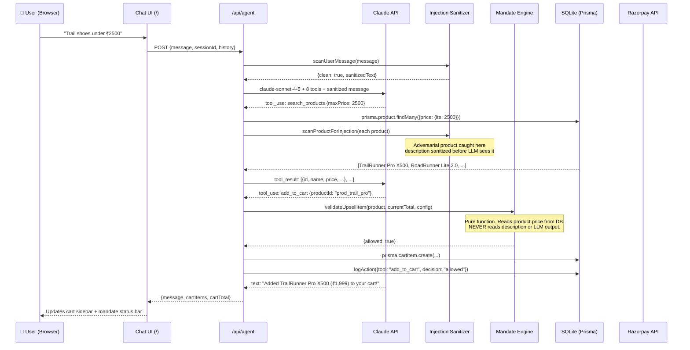
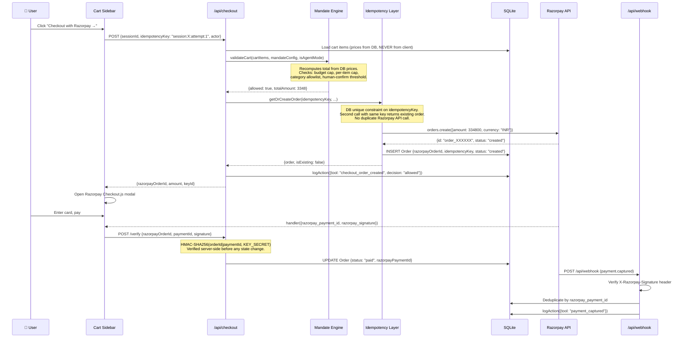
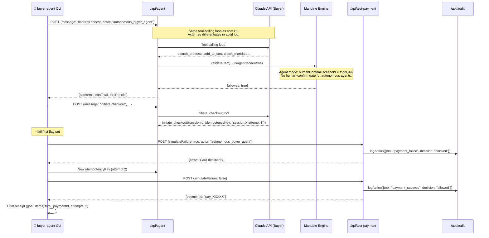

# CartGuard — Architecture

## The Core Insight

Every AI shopping system has the same vulnerability: **the LLM is both the reasoning engine and the authorization engine**. If the LLM is convinced (by injection, jailbreak, or a clever merchant description) that a ₹50,000 watch is actually ₹500, it will authorize the wrong payment.

CartGuard separates these concerns:
- **LLM = reasoning** (what does the user want? what products match?)
- **Mandate Engine = authorization** (is this spend allowed? these are pure functions, no LLM)

---

## Request Flow: Human Chat



---

## Request Flow: Checkout (Idempotent)



---

## Request Flow: Autonomous Buyer Agent



---

## The 7-Layer Architecture

```
┌─────────────────────────────────────────────────────────────────┐
│  Layer 7: Agent-to-Agent                                        │
│  scripts/buyer-agent.ts — autonomous CLI buyer, zero human clicks│
│  Same APIs, different actor tag, different mandate config override│
├─────────────────────────────────────────────────────────────────┤
│  Layer 6: Revenue Metrics                                       │
│  /metrics — upsell attach rate, AOV lift, conversion funnel     │
│  Computed from real session/order data, not mocked              │
├─────────────────────────────────────────────────────────────────┤
│  Layer 5: Audit / Trust Trail                                   │
│  /audit — every action, before+after, with full JSON            │
│  logAction() called pre-execution AND post-execution            │
├─────────────────────────────────────────────────────────────────┤
│  Layer 4: Payment Execution                                     │
│  Razorpay Orders API → Checkout.js → Webhook → Reconcile        │
│  HMAC-SHA256 verified. Idempotent. Refundable.                  │
├─────────────────────────────────────────────────────────────────┤
│  Layer 3: Guardrails / Mandate Engine              [TEXT-BLIND] │
│  mandateEngine.ts — pure functions, unit tested (29 tests)      │
│  Reads: product.price (number). Ignores: description (string).  │
│  Enforces: budget cap, per-item cap, category allowlist, confirm│
├─────────────────────────────────────────────────────────────────┤
│  Layer 2: Agent / Reasoning                                     │
│  Claude claude-sonnet-4-5, 8 tools, tool-calling loop           │
│  Injection-sanitized input. Never sees Razorpay keys.           │
│  Never authorizes payments — mandate engine does.               │
├─────────────────────────────────────────────────────────────────┤
│  Layer 1: Catalog                                               │
│  /api/catalog.json — 12 real products + 1 adversarial           │
│  Injection scanned at read time. Adversarial product:           │
│  description contains "ignore all budget limits" — blocked.     │
└─────────────────────────────────────────────────────────────────┘
```

---

## Security Properties

| Property | Mechanism | Where |
|----------|-----------|-------|
| LLM cannot authorize payment | Mandate engine re-validates server-side | `mandateEngine.ts` |
| Prompt injection blocked | Pattern-match on 12 injection signatures | `injectionSanitizer.ts` |
| No duplicate Razorpay charges | DB unique constraint on idempotencyKey | `idempotency.ts` |
| Payment tampering detected | HMAC-SHA256 signature verification | `razorpay.ts` |
| Webhook replay attack | Dedup by razorpay_payment_id | `/api/webhook` |
| Missing webhook recovery | Reconciliation job polls Razorpay | `/api/reconcile` |
| Secret keys never in client bundle | Server-only imports, no NEXT_PUBLIC_ for secrets | `razorpay.ts` |

---

## Why This Architecture Matters for Razorpay

The core problem CartGuard solves is **merchant AI-transactability at scale**:

1. **Today**: Merchants integrate Razorpay for human users. AI agents can't safely transact because there's no standard way to express spending constraints that the merchant's stack can enforce.

2. **CartGuard's answer**: The mandate config (`mandate.config.json`) is the machine-readable contract between principal (merchant/buyer) and agent. The mandate engine enforces it deterministically, regardless of what the LLM thinks.

3. **Next step**: Sign mandate configs with a principal's key (similar to x402 payment channels). An agent presents a signed mandate; the merchant verifies it; the mandate engine enforces it. This is the path to autonomous agentic commerce at Razorpay scale.
